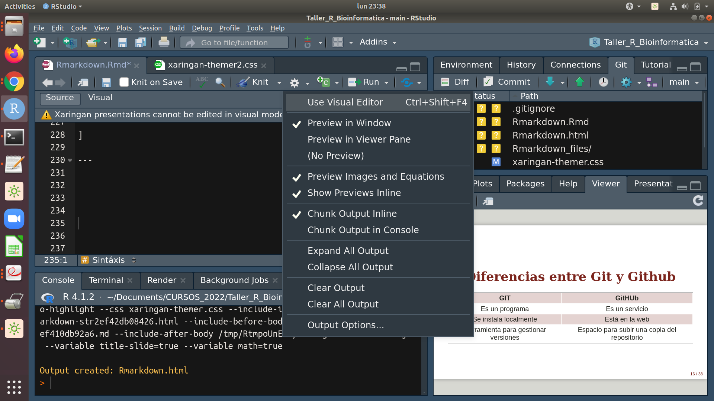
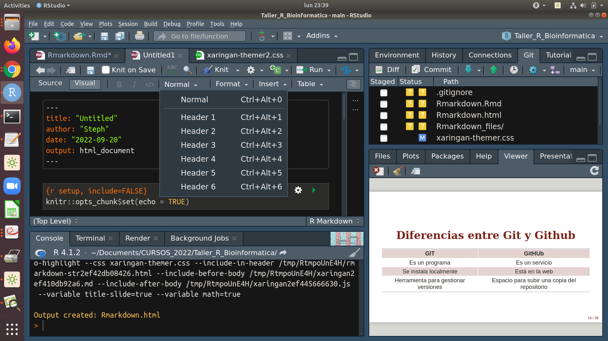
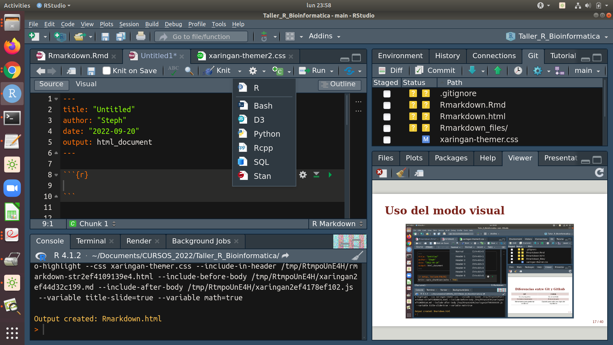

```{r xaringan-themer, include=FALSE, warning=FALSE, eval=FALSE}
library(xaringanthemer)
style_mono_accent(
  base_color = "#7B241C",
  header_font_google = google_font("Plex Mono Semi Bold"),
  text_font_google= google_font("Plex Serif Regular", "400", "400i"),
  text_font_size = "1.5rem",
  code_font_google   = google_font("Fira Mono")
)
```
class: inverse, center, middle
background-image: url(https://rubenfcasal.github.io/bookdown_intro/images/rmarkdown.png)
background-size: contain


```{r setup, include=FALSE}
options(htmltools.dir.version = FALSE)
```


---
class: inverse, center, middle

# ¿Qué necesitaremos para la clase de hoy?

---
class:  middle

## **Para la clase de hoy vamos a necesitar:**

- ####R y Rstudio (últimas versiones recomendable)
- ####Rmarkdown (paquete instalado):
```{r, eval=FALSE}
# Instalar de CRAN
install.packages('rmarkdown')

# o la versión en desarrollo de Github
if (!requireNamespace("devtools"))
  install.packages('devtools')
devtools::install_github('rstudio/rmarkdown')
```


- ####Tener instalado LaTeX o tinytex:

```{r, eval=FALSE}
install.packages('tinytex')
tinytex::install_tinytex()  # install TinyTeX
```

---
class: inverse, center, middle

# ¿Qué es y para qué sirve Rmarkdown?


---

# ¿Qué es Rmarkdown? 

- Es un paquete creado en 2014. 

- Durante los últimos ha evolucionado hasta convertirse en un ecosistema relativamente completo para la creación de documentos.

- Rmarkdown se basa en el lenguaje markdown que sirve para convertir texto plano a formato HTML. Este tipo de archivo de archivo esta disponible en RStudio, y esto nos permite integrar código con texto con formato.
---
class: inverse, center, middle

# ¿Qué podemos hacer en Rmarkdown?


---
# Cosas que podemos hacer en Rmarkdown: 

> 1. Compilar un solo documento R Markdown en un informe en diferentes formatos, como PDF, HTML o Word.

> 2. Crear cuadernos en los que pueda ejecutar directamente fragmentos de código de forma interactiva.

> 3. Crear diapositivas para presentaciones (HTML5, LaTeX Beamer o PowerPoint).

> 4. Crar aplicaciones interactivas basadas en Shiny.

> 5. Escribir artículos de revistas, capítulos de libros y tesis. 

> 6. Generar sitios web y blogs.


---
# ¿Cómo es el proceso de generación de documentos?

```{r echo=FALSE, out.height=300, out.width= 600, fig.align='center'}
knitr::include_graphics("https://bookdown.org/yihui/rmarkdown-cookbook/images/workflow.png")
```

**RMD** es nuestro código editable de Rmarkdown que se teje con `knitr`  convirtiendose en un archivo **MD** de lenguaje markdown para luego ser compilado por `pandoc` en cualquier arhchivo de salida que le indiquemos


---
#Algunos usos...

- Diapositivas personalizadas ([**xaringan**](https://github.com/yihui/xaringan), [**prettydoc**](https://github.com/yixuan/prettydoc))

- Curriculum vitae ([**vitae**](https://github.com/mitchelloharawild/vitae))

- Artículos y documentos académicos ([**rticles**](https://github.com/rstudio/rticles))

- Libros ([**bookdown**](https://github.com/rstudio/bookdown))

- Blogs ([**blogdown**](https://github.com/rstudio/blogdown))

- Documentos automatizados/[**certificados**](https://www.andreashandel.com/posts/certificate-generation/)

- Otras cosas más ([**stevetemplates**](https://github.com/svmiller/stevetemplates), [**pagedown**](https://github.com/rstudio/pagedown))

- Websites ([**postcards**](https://github.com/seankross/postcards))


---
class: inverse, center, middle

# ¡Manos a la obra!

---
#Generar un archivo nuevo Rmarkdown

Primero vamos a abrir nuestro arhchivo nuevo:

> Vamos a `File` > `New File` > `R Markdown...`

Luego, vamos a escoger el tipo:
> - Documento (html, pdf, word)
> - Presentation (html, pdf, word, powerpoint)
> - Shiny (Document, presentation)
> - From Template (varios, dependiendo del paquete)

Vamos a escoger realizar un Documento html y probemos dar Knit. Listo!

---
# Estructura de un archivo de Rmarkdown
Los metadatos YAML se procesan en muchas etapas del proceso de renderizado y pueden influir en el documento final de muchas maneras diferentes. Se coloca al principio del documento y lo lee Pandoc, rmarkdown y knitr.

Un encabezado YAML típico tiene este aspecto y contiene metadatos básicos sobre el documento y las instrucciones de representación:
```{r, eval=FALSE}
---
title: My R Markdown Report
author: Steph
output:
  html_document:
    toc: true
    toc_float: true
---
```

En este caso, Pandoc procesa los campos de título y autor para establecer los valores de las variables de la plantilla.
---
# Ejemplo de presentación con más formato
```{r, eval=FALSE}
---
title: "Ecología de comunidades en R- clase 1"
author: | 
  | Ph D.Stephanie Hereira-Pacheco 
  | CTBC
  | UATx
date: "`14 - 03 - 2022`"
output: 
 beamer_presentation:
    theme: "Boadilla"
    colortheme: "beaver"
    fonttheme: "structurebold"
fontsize:  9 pt
---
```

[Galerías](https://deic.uab.cat/~iblanes/beamer_gallery/),
[Templates](https://hartwork.org/beamer-theme-matrix/).

---
# Narrativa
- Los elementos textuales narrativos se parecerán un poco a escribir en un editor de texto. 

- Encabezados o headers: dan estructura a todo nuestro documento, ya que rmarkdown convierte el .md a nuestro formato de salida final. 

.pull-left[
```{r, eval=FALSE}
# Primer nivel

## Segundo nivel

### Tercer nivel
```

]

.pull-right[
# Primer nivel

## Segundo nivel

### Tercer nivel

]

---
# Sintáxis 

.pull-left[
```{r, eval=FALSE}

  Lista principal
  + manzanas
    - amarilla
    - roja

Otra lista
1. *Casa*
2. **Salón**
> ***Lista o cita en bloque*** 
> 1. Esta es una lista dentro de una cita
 
```

]

.pull-right[
  Lista principal
  + manzanas
    - amarilla
    - roja

Otra lista
1. *Casa*
2. **Salón**
> ***Lista o cita en bloque*** 
> 1. Esta es una lista dentro de una cita

]

---
# Uso del modo visual 

```{r, echo=FALSE, fig.align='center', out.width='80%'}

```
---

# Uso del modo visual 

```{r, echo=FALSE, fig.align='center', out.width='80%'}

```
---
# Chunks
.pull-left[
- En R y Rmarkdown podemos hacer chunks para varios lenguajes. Por ejemplo para R, o para bash, python, sql, etc. 

- Podemos abrir un nuevo chunk de R manualmente o usar el comando : 
`Ctrl` + `Alt` + I
]
.pull-right[
```{r, echo=FALSE, fig.align='center'}

```
]
---
# Chunks de R

Hay una variedad de opciones quen afectan la forma en que los fragmentos de código son tratado

- Usa `echo=FALSE` para evitar que se muestre el código en sí.
- Usa `results="hide"` para evitar que se impriman los resultados.
- Usa `eval=FALSE` para tener el código mostrado pero no evaluado.
- Usa `warning=FALSE` y `message=FALSE` para ocultar cualquier advertencia o mensajes producidos
- Usa `fig.height`, `fig.width` y `fig.align` para controlar el tamaño de las figuras    producidas y como se alinean.
Entonces podrías escribir:


---
# Diapositivas con xaringan
Este es un paquete adicional, que puede instalarse así:

```{r, eval=FALSE}
remotes::install_github('yihui/xaringan')
```

[Manuales](https://github.com/yihui/xaringan/wiki) y [documentación](https://github.com/yihui/xaringan).

Ya instalado podemos acceder al formato dando:
`File` > `New File` > `Rmarkdown` > `From template` > `Ninja presentation`

Además del formato podemos ver los cambios al instante, con el código:

```{r, eval=FALSE}
xaringan::infinite_moon_reader()
```

---
# Formato de xaringan

```{}
library(xaringanthemer)
style_mono_accent(
  base_color = "#7B241C",
  header_font_google = google_font("Plex Mono Semi Bold"),
  text_font_google= google_font("Plex Serif Regular", "400", "400i"),
  text_font_size = "1.5rem",
  code_font_google   = google_font("Fira Mono")
)
```

```{r, eval=FALSE}
install.packages("xaringanthemer")
#ó
remotes::install_github("gadenbuie/xaringanthemer")
```
[Manual](https://pkg.garrickadenbuie.com/xaringanthemer/articles/xaringanthemer.html)

---
# Haciendo de mi Rmarkdown una página web
- Para este paso debemos primero crear un repositorio en Github ligado a nuestra sesión (como lo vimos la clase anterior).

- Ya generado nuestro documento, cv, libro, etc. Podemos darle `pull` > `commit` > `push` y subir nuestro documento.

- Luego configuramos nuestro Github para hacerlo página entrando al respositorio donde está nuestro documento y vamos a `Settings` > `Pages` y aquí cambiamos el branch para que salga `main` y `root` y listo! esperamos un poco y ya podemos visualizar nuestra página.

   https://steph0522.github.io/mi_presentacion/presentacion.html


---
class: center, middle

# ¡Gracias!
Las diapositivas se construyeron con el paquete de R [**xaringan**](https://github.com/yihui/xaringan).

---

# Referencias

- https://bookdown.org/yihui/rmarkdown/

- https://bookdown.org/yihui/rmarkdown-cookbook/

- https://swcarpentry.github.io/r-novice-gapminder-es/15-knitr-markdown/

- https://comunidadbioinfo.github.io/cdsb2022/generaci%C3%B3n-de-reportes-con-r-markdown..html

